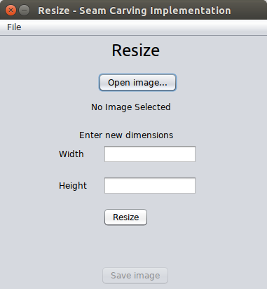
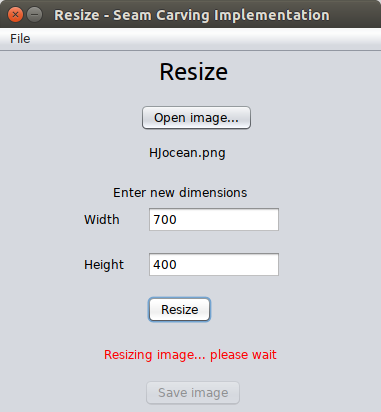
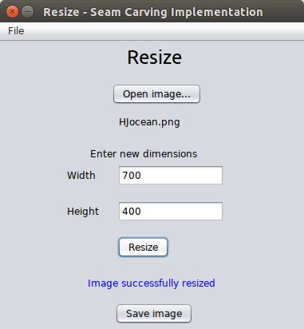

# Seam-Carving
Implementation of Seam Carving algorithm in Java

## Features
* Implemented Seam Carving algorithm in Java. 
* GUI Developed using Java Swing.
* Implemented thread based process for resizing an image which allows resizing process to work in background. 
* User can save the image after resizing it.

